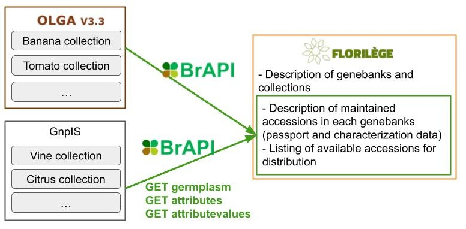

#### FLORILÈGE

<!-- Alice B -->
Designed primarily for the general public, Florilège provides access to public collections of all French plant biological resources centers. This web portal allows a user to browse available plant genetic resource accessions and allows the user to order some seeds or plant material for cultivation. It includes plant genetic resources of around 50 plant genus from 19 genebanks.

Florilège retrieves accession information from different BrAPI compliant systems. They include OLGA, a genebank accessions information management system, and GnpIS, an INRAE data repository for plant genetic resources, phenomics, and genetics [@doi:10.34133/2019/1671403;@doi:10.1007/978-1-4939-6658-5_5]. Using BrAPI to gather data from these systems reduced development efforts and enabled standardized data retrieval. As a consequence, BrAPI is the de facto standard for exchanging data within the French plant genetic resources community. The Florilège team also requested several updates to the BrAPI specifications to better serve this use case, such as Collection or improved external references.

<!-- {#fig:Schema_Florilege width="100%"} -->
